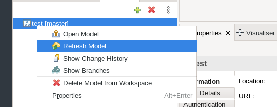
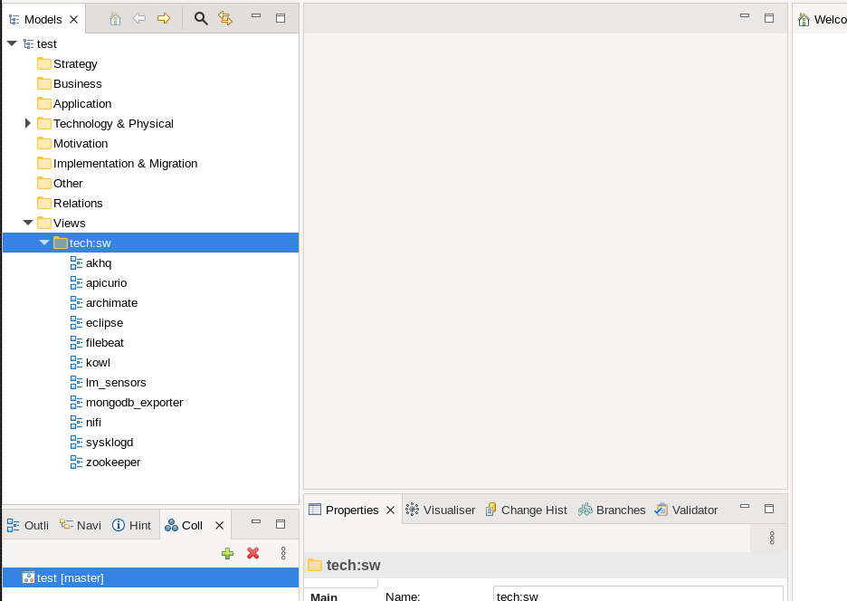
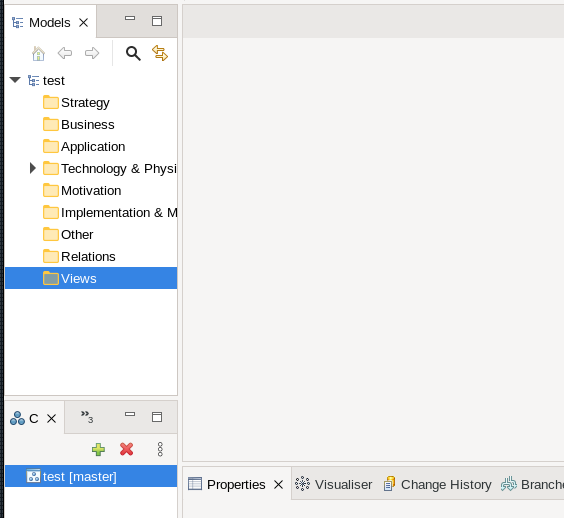
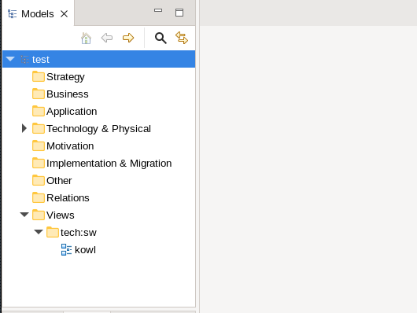

Archi PyDiagram
=================

Bulk import/creation of Archimate diagram views from Mongodb collection.

TLDR;
----------

Given a mongodb collection _tech.sw_, with document "_ids_":

```
$ mongo $RS1 --quiet --eval "db.tech.sw.find({},{'_id':1})"
{ "_id" : "akhq" }
{ "_id" : "apicurio" }
{ "_id" : "archimate" }
{ "_id" : "eclipse" }
{ "_id" : "filebeat" }
{ "_id" : "kowl" }
{ "_id" : "lm_sensors" }
{ "_id" : "mongodb_exporter" }
{ "_id" : "nifi" }
{ "_id" : "sysklogd" }
{ "_id" : "zookeeper" }

```

and; Archimate:


Run _archi-pydiagram_ to import/create Archimate diagrams:

```
$ ./archi-pydiagram import-diagrams $RS1 repo/model/diagrams tech.sw
 import_diagrams:<<<<<  (tech.sw)      >>>>
 import_diagrams:Create (Folder) tech:sw
 import_diagrams:Create (ArchimateDiagramModel) tech:sw.akhq
 import_diagrams:Create (ArchimateDiagramModel) tech:sw.apicurio
 import_diagrams:Create (ArchimateDiagramModel) tech:sw.archimate
 import_diagrams:Create (ArchimateDiagramModel) tech:sw.eclipse
 import_diagrams:Create (ArchimateDiagramModel) tech:sw.filebeat
 import_diagrams:Create (ArchimateDiagramModel) tech:sw.kowl
 import_diagrams:Create (ArchimateDiagramModel) tech:sw.lm_sensors
 import_diagrams:Create (ArchimateDiagramModel) tech:sw.mongodb_exporter
 import_diagrams:Create (ArchimateDiagramModel) tech:sw.nifi
 import_diagrams:Create (ArchimateDiagramModel) tech:sw.sysklogd
 import_diagrams:Create (ArchimateDiagramModel) tech:sw.zookeeper

```

Change into _repo_, add _model/diagrams/*_, commit.

```
$ cd repo
$ git add model; git commit -am "Add tech:sw diagrams" 
[master bd831ce] Add tech:sw diagrams
 12 files changed, 12 insertions(+)
 create mode 100644 model/diagrams/id-085c4046f9cd11ec90b8665ec999a661/ArchimateDiagramModel_id-085c5d74f9cd11ec90b8665ec999a661.xml
 create mode 100644 model/diagrams/id-085c4046f9cd11ec90b8665ec999a661/ArchimateDiagramModel_id-085c6dc8f9cd11ec90b8665ec999a661.xml
 create mode 100644 model/diagrams/id-085c4046f9cd11ec90b8665ec999a661/ArchimateDiagramModel_id-085c7dccf9cd11ec90b8665ec999a661.xml
 create mode 100644 model/diagrams/id-085c4046f9cd11ec90b8665ec999a661/ArchimateDiagramModel_id-085c8d6cf9cd11ec90b8665ec999a661.xml
 create mode 100644 model/diagrams/id-085c4046f9cd11ec90b8665ec999a661/ArchimateDiagramModel_id-085c9d3ef9cd11ec90b8665ec999a661.xml
 create mode 100644 model/diagrams/id-085c4046f9cd11ec90b8665ec999a661/ArchimateDiagramModel_id-085caccaf9cd11ec90b8665ec999a661.xml
 create mode 100644 model/diagrams/id-085c4046f9cd11ec90b8665ec999a661/ArchimateDiagramModel_id-085cbcbaf9cd11ec90b8665ec999a661.xml
 create mode 100644 model/diagrams/id-085c4046f9cd11ec90b8665ec999a661/ArchimateDiagramModel_id-085ccc78f9cd11ec90b8665ec999a661.xml
 create mode 100644 model/diagrams/id-085c4046f9cd11ec90b8665ec999a661/ArchimateDiagramModel_id-085cdfa6f9cd11ec90b8665ec999a661.xml
 create mode 100644 model/diagrams/id-085c4046f9cd11ec90b8665ec999a661/ArchimateDiagramModel_id-085cefc8f9cd11ec90b8665ec999a661.xml
 create mode 100644 model/diagrams/id-085c4046f9cd11ec90b8665ec999a661/ArchimateDiagramModel_id-085cff40f9cd11ec90b8665ec999a661.xml
 create mode 100644 model/diagrams/id-085c4046f9cd11ec90b8665ec999a661/folder.xml
Enumerating objects: 20, done.
Counting objects: 100% (20/20), done.
Delta compression using up to 8 threads
Compressing objects: 100% (17/17), done.
Writing objects: 100% (17/17), 1.51 KiB | 221.00 KiB/s, done.
Total 17 (delta 12), reused 0 (delta 0), pack-reused 0
remote: . Processing 1 references
remote: Processed 1 references in total
To ssh://repo.internal/model-repository.git
   a0b3f30..bd831ce  master -> master
$
```

Archimate, _Refresh Model_:



Observe imported diagrams:




More Details
-----------------

Run _archi-pydiagram_ *-h* for options

``` 
$ ./archi-pydiagram import-diagrams -h
usage: PROG import-diagrams [-h] [-m MATCH] [-a ATTRIBUTE] [-l LOG_LEVEL] mongo_url dp_repo cltn_match

positional arguments:
  mongo_url             URL for mongodb connection
  dp_repo               Root path to local clone of model-repository
  cltn_match            Mongodb collection to create views from

optional arguments:
  -h, --help            show this help message and exit
  -m MATCH, --match MATCH
                        Optional document *name* match
  -a ATTRIBUTE, --attribute ATTRIBUTE
                        Optional document attribute to get diagram id from
  -l LOG_LEVEL, --log-level LOG_LEVEL
                        set log level
$

```

ie, to only import "kowl":



```
$ ./archi-pydiagram import-diagrams $RS1 repo/model/diagrams tech.sw --match kowl
 import_diagrams:<<<<<  (tech.sw)      >>>>
 import_diagrams:Create (Folder) tech:sw
 import_diagrams:Create (ArchimateDiagramModel) tech:sw.kowl

```



